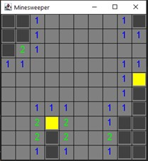
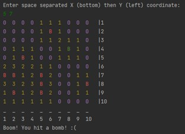
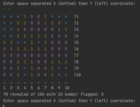
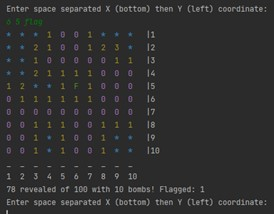

# 1.1 Minesweeper Game Clone Overview

**Overview written by Peter Mitchell.**

## Contents

```
1.1 Minesweeper Game Clone Overview 
1.2 Introduction
1.3 The Rules of Minesweeper 
1.4 High Level Discussion About Implementation
1.5 How the Core Game Works 
1. 6 Implementation as a CLI 
1.7 Implementation as a GUI
1.8 Features You Could Add 
```

# 1.2 Introduction

This document will explain the fundamentals of how the Minesweeper game works. 

- ([Youtube Demo](https://youtu.be/DvsNwkEJrzc))

# 1.3 The Rules of Minesweeper

Minesweeper has a very simple set of rules that are clearly defined allowing distinct elements to be
designed and developed to cater for each requirement.

- The game consists of a grid of cells.
- Some portion of the cells on the grid are bombs waiting to explode.
- The state of each cell on the grid is hidden until interacted with by a player.
- Revealing a cell shows the content of that cell.
- Revealing a cell that has a bomb hidden under it results in a game over.
- Revealed cells show the number of neighbouring cells with bombs.
- Revealing a cell that has no nearby neighbours reveals additional nearby cells that also do not
    have neighbours and those bordering on these cells.
- Cells can be flagged by the player to mark them as being suspected as bombs.
- Cells that are flagged should not be revealed upon interaction until the flag is removed.
- The game is won when all non-bomb cells have been revealed.


# 1.4 High Level Discussion About Implementation

For the purposes of this example the game has been developed to work in two distinct ways. One way
uses a command line interface (CLI) where the user will type in numbers representing the row/column
they want to interact with. The other way is with a graphical user interface (GUI), where the user will
interact with a panel using mouse clicks. The implementation of the CLI and GUI both use the same
base code where practical to keep the visual representation and behind the scenes separate. The
following list identifies how each of these are separated and what is shared between both
implementations.

Shared Classes:

- Board: defines the concept of a board that is filled with Cells.
- Cell: defines the state information about a single Cell on a Board.
- Pair: defines a pair of values to represent x,y to simplify part of the revealing process.
- Main: entry point for the games that allows selection of which to start.

CLI Specific Class:

- Game: defines a game loop using the Board class to manage the game state in the CLI.

GUI Specific Classes:

- BoardPanel: stores and represents visually a Board object within a panel.
- GUI: creates the frame for the GUI and adds in a BoardPanel.

 

The images above show examples of the GUI and CLI interfaces. On the left you can see the GUI with
dark grey cells not yet revealed, the light grey cells are all revealed with no bomb neighbours, the
numbered cells have bombs near them, the yellow cells are cells that are flagged.

On the right is an example of the CLI right after losing the game to hitting a bomb. You can see each
cell is represented by the coordinates on the bottom and top. The numbers show how many nearby
bombs there are like the GUI, the Bs show the exposed bombs after losing. The green B shows a
successfully flagged bomb. Above the board you can see the input that caused a loss.


# 1.5 How the Core Game Works

For this section, the focus is on the classes Cell and Board with some discussion about Pair as well. The
Board class is defined to have a 2D grid of Cells to define the play space. The Board provides methods
that allow access to the properties at specific positions on the Board. The Board does not enforce all
the rules, but it does provide the tools to enforce all the rules for each of the specific implementations.

Looking first at the Cell it defines a few important properties that modify how the state of the cell are
interpreted. The variables include the following:

- boolean isBomb: true indicates this cell is a bomb and should be part of the win/loss
    conditions.
- boolean isRevealed: true indicates that this cell has been revealed to show the true value
    instead of hiding it as a mystery. This is expected to be either a result of the player revealing
    the cell, or when all cells are revealed after the game has ended.
- boolean isFlagged: true indicates this cell has been specifically flagged by the player. The value
    can be used to prevent revealing by accident, but it is not enforced within this class.
- int neighbours: indicates the number of nearby bombs to use as the visual number for
    revealed cells.

The following methods are getter/setter methods for the above:

- resetCell() resets all the values back to defaults.
- setAsBomb() and getIsBomb() for isBomb.
- reveal() and getIsRevealed() for isRevealed.
- addNeighbour() and getNeighbours() for neighbours.
- getIsFlagged() and toggleIsFlagged() for isFlagged.

The remaining methods are for getting a String representation of the Cell.

- toString() gives a single character to show the state of the cell based on all four of the
    variables.
- getColouredString() takes the toString() result and adds colour data for printing to the CLI.
- colourString() applies the colour data as a helped method for getColouredString().

For the Board it is made up with Cells and some additional state information to simplify outputs. The
following variables make up a Board:

- Cells[][] cells: contains the 2D array of cells to be stored.
- int width and int height: represent the width and height of the content stored in the arrays.
    This could be derived from checking the lengths of the array, but it is better to have the values
    cached for clear use.
- int bombCount: stores the number of bombs on the board to be used for checking if the game
    is over.
- int revealedTotal: stores a summary value counting how many Cell objects have been revealed
    without having to loop through all of them to count.
- int flaggedCount: stores a summary value counting how many Cell objects are currently
    flagged, in a similar way to revealedTotal.


The constructor creates the empty Board with specified width and height. The following are getter
and settermethods as part of Board:

- isCellBomb() to check if the Cell at a position is a bomb.
- isCellRevealed() to check if the Cell at a position is revealed.
- isCellFlagged() to check if the Cell at a position is flagged.
- getCellString() to get the visual representation of the Cell at a position.
- getWidth() and getHeight() to retrieve the width/height variables.
- getCellAt() to retrieve a reference to the full details of a Cell.
- flagCell() to toggle a Cell between flagged states at a position.

Other more complicated methods and methods that serve additional functionality include:

- printBoard(): to print a coloured version of the Board to the CLI.
- printStatus(): to print a status line about the number of revealed elements to the CLI.
- revealCell(): will either reveal a single cell at the position or will call methods to use flood fill
    finding all cells that should be revealed, followed by another pass to find all the cells on the
    borders.
- spawnBombs(): to spawn up to a maxBombs number of bombs using the addBomb() method.
- revealAll(): to reveal all the cells regardless of content to be used when a game is over.
- addBomb(): to place a bomb at a specified location and notify all neighbours of the new bomb.
- validCoord(): to verify a position is within the valid range of numbers for x and y.
- floodFillReveal(): Searches for all adjacent cells to find all the cells without neighbours and
    reveal them.
- revealAroundListOfPoints(): takes the result of the floodFillReveal() to find all cells bordering
    and revealing those as well by calling revealAllAroundPoint().
- revealAllAroundPoint(): takes a single point and iterates through all neighbouring cells to
    reveal them.


# 1.6 Implementation as a CLI

The implementation as a CLI is very similar to the type of code you would have seen in the RPG Text
Game. The only file that is specific to just the CLI is the Game class. Inside the Game class you can see
there is very little needed to set up the game and interact with it. Firstly, going through the variables
that have been include:

- Board board: gives us the reference to the Board object and all the utility we defined in the
    previous section.
- Scanner scan: defines a shared reference to the Scanner object for input.
- int targetX and targetY: are used to store the player’s choice of targeted cell for either a reveal
    or flag action.

The constructor sets up the game by initialising the board with a 10 by 10 size and spawns 10 bombs,
along with setting up the Scanner ready for player input. The other methods defined as part of the
Game class include the following:

- startGame(): defines the game loop with calls to print the board, handle input, and determine
    the victory state. This does almost all the work of interacting with the Board class.
- showFinalBoard(): is a helper method to force reveal all the Cells and then print the Board to
    be used for when the game ends.
- getInput(): is a helper method to read input and ensure it contains two valid integers that do
    refer to a valid position on the Board.
- isInputValid(): is used to validate the position selected in getInput() by verifying it is within the
    Board, and disallowing it if the cell is already revealed.
- getStringOrQuit(): is a helper method for helping to sanitise input by using nextLine() while
    also checking if it includes a command to quit.

 

The above images show examples of revealed cells and then an example of what happens when the
“flag” text is added after a coordinate (see the F in the middle at 6 5).


# 1.7 Implementation as a GUI

The GUI implementation of the game follows the same approach as the CLI version, except it is being
rendered as a window with the ability to interact with the mouse instead of the keyboard. The GUI
class starts off the implementation by creating the frame to hold the panel and adds in a BoardPanel.
All the important GUI specific work happens in BoardPanel. The following attributes are used to define
the BoardPanel.

- Board board: represents the reference to the Board object with all the state information.
- final int CELL_WIDTH and CELL_HEIGHT: hold the dimensions in pixels that each cell should be
    given as part of the grid.
- int boardWidth and boardHeight: hold the dimensions of how many cells are held inside the
    Board object.
- int state: tracks the state of the game with 0 meaning game running, 1 is the game was lost, 2
    is the game was won.
- Font font: the font used for rendering numbers on the Board.
- Font endfont: the font used for rendering the victory/defeat message.

The BoardPanel’s functionality initialises some of the configuration needed to make a JPanel that will
be pack()-ed into the JFrame. The constructor initialises all the important features. The preferredSize
is set based on the CELL_WIDTH and CELL_HEIGHT in pixels based on the requested boardWidth and
boardHeight in number of cells. This class also implements a MouseListener. The interface methods
are implemented as part of the BoardPanel class so the current panel is added with
addMouseListener(this); to let it receive the input. The Board is also set up with the specified size and
up to 10 bombs spawned. The remaining methods fall into two categories. Most are methods related
to drawing the game elements to the screen and the last methods are for handling the required
interface methods for the MouseListener. The following summarise all the methods used for drawing
to the panel.

- paint(): this method is called automatically whenever a repaint() is triggered. This occurs when
    the panel is first drawn, when repaint() is manually called, and in some other specific
    situations. Mostly for this application repaint() is triggered at the end of the mouse events.
    The paint method is responsible for calling all the other methods that follow.
- drawGrid(): this draws a grid made up of horizontal and vertical lines.
- drawEndPopup(): draws an overlay with text indicating if the game was won or lost.
- drawFilledCell(): draws a single filled rectangle with a specified colour at a place matching the
    Board positioning.
- drawCellContent(): draws a single character of text at the Cell location on the Board.
- getColourForCell(): is used to get the appropriate font colour to use when drawing Cell text.

The MouseListener does require implementing all methods, you may see that many of them have
been noted as “Not used” in the comments. The only one that was necessary for this game was
mouseClicked. The mouseClicked method checks where was clicked relative to a Cell position, and
whether it was a left or right click. Then uses this information to perform similar actions to what was
handled in the CLI. Where a left click attempts to reveal the target Cell, then tests for an end of game
event, or toggles the flag on the cell if a right click. After all the updates to the game state are complete
a repaint() call forces the panel to be redrawn.


# 1.8 Features You Could Add

This implementation is very simplistic to make it easy to observe how it works. There are quite a few
additional features you could look at and learn how to implement. The CLI version does not have much
that could be changed, but the GUI version has a lot that could be improved. The following list of
features are things you could try and implement yourself to test your abilities.

- Implement a difficulty option so it changes the number size of the Board and the number of
    bombs that are spawned.
- Add in images for objects like the bombs. Currently everything is just text, adding some unique
    graphics and learning to render images will make the game more interesting visually.
- Add in additional panels to show the number of remaining bombs or other metrics.
- You could try adding a timer to either score the player based on how long they took, or to
    force the player to win within the constraint of a timer.
- Implement a way to restart the game after the game is complete, currently the game ends
    entirely when it is over. Hint: the individual cells already contain a resetCell() method.
- Improve the spawnBomb() method so that it will always spawn the specified number of bombs
    instead of only spawning up to the maximum.
- Implement your own additional rules to increase the challenge.


